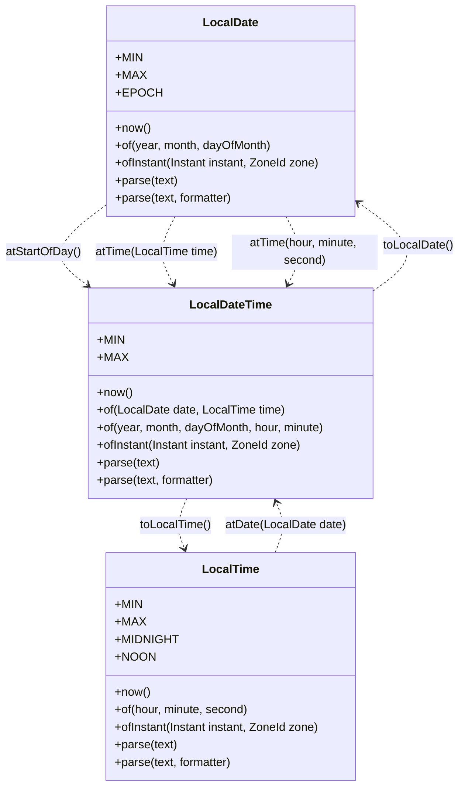
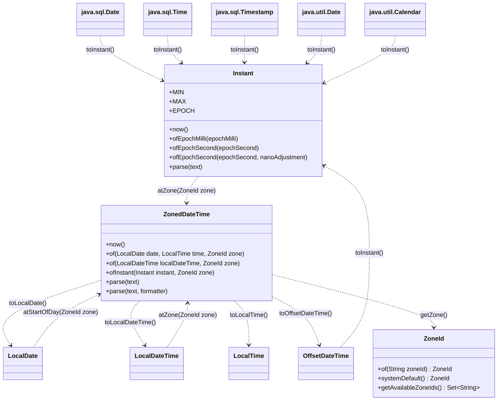

# package java.time
## LocalDate – LocalDateTime – LocalTime

```mermaid
classDiagram

class LocalDate {
  +MIN
  +MAX
  +EPOCH
  +now()
  +of(year, month, dayOfMonth)
  +ofInstant​(Instant instant, ZoneId zone)
  +parse(text)
  +parse(text, formatter)
}

link LocalDate "https://docs.oracle.com/en/java/javase/11/docs/api/java.base/java/time/LocalDate.html" "java.time.LocalDate (Java SE 11 API Specification)"
LocalDate ..> LocalDateTime : atStartOfDay()
LocalDate ..> LocalDateTime : atTime(LocalTime time)
LocalDate ..> LocalDateTime : atTime(hour, minute, second)

class LocalTime {
  +MIN
  +MAX
  +MIDNIGHT
  +NOON
  +now()
  +of(hour, minute, second)
  +ofInstant​(Instant instant, ZoneId zone)
  +parse(text)
  +parse(text, formatter)
}

link LocalTime "https://docs.oracle.com/en/java/javase/11/docs/api/java.base/java/time/LocalTime.html" "java.time.LocalTime (Java SE 11 API Specification)"
LocalTime ..> LocalDateTime : atDate(LocalDate date)

class LocalDateTime {
  +MIN
  +MAX
  +now()
  +of(LocalDate date, LocalTime time)
  +of(year, month, dayOfMonth, hour, minute)
  +ofInstant​(Instant instant, ZoneId zone)
  +parse(text)
  +parse(text, formatter)
}

link LocalDateTime "https://docs.oracle.com/en/java/javase/11/docs/api/java.base/java/time/LocalDateTime.html" "java.time.LocalDateTime (Java SE 11 API Specification)"
LocalDateTime ..> LocalDate : toLocalDate()
LocalDateTime ..> LocalTime : toLocalTime()
```
## Instant – ZonedDateTime – ZoneId

```mermaid
classDiagram

`java.sql.Date` ..> Instant : toInstant()
`java.sql.Time` ..> Instant : toInstant()
`java.sql.Timestamp` ..> Instant : toInstant()
`java.util.Date` ..> Instant : toInstant()
`java.util.Calendar` ..> Instant : toInstant()

link `java.sql.Date` "https://docs.oracle.com/en/java/javase/11/docs/api/java.sql/java/sql/Date.html" "java.sql.Date (Java SE 11 API Specification)"
link `java.sql.Time` "https://docs.oracle.com/en/java/javase/11/docs/api/java.sql/java/sql/Time.html" "java.sql.Time (Java SE 11 API Specification)"
link `java.sql.Timestamp` "https://docs.oracle.com/en/java/javase/11/docs/api/java.sql/java/sql/Timestamp.html" "java.sql.Timestamp (Java SE 11 API Specification)"
link `java.util.Date` "https://docs.oracle.com/en/java/javase/11/docs/api/java.base/java/util/Date.html" "java.util.Date (Java SE 11 API Specification)"
link `java.util.Calendar` "https://docs.oracle.com/en/java/javase/11/docs/api/java.base/java/util/Calendar.html" "java.util.Calendar (Java SE 11 API Specification)"

class Instant {
  +MIN
  +MAX
  +EPOCH
  +now()
  +ofEpochMilli(epochMilli)
  +ofEpochSecond​(epochSecond)
  +ofEpochSecond​(epochSecond, nanoAdjustment)
  +parse​(text)
}

link Instant "https://docs.oracle.com/en/java/javase/11/docs/api/java.base/java/time/Instant.html" "java.time.Instant (Java SE 11 API Specification)"
Instant ..> ZonedDateTime : atZone(ZoneId zone)

LocalDateTime ..> ZonedDateTime : atZone(ZoneId zone)
LocalDate ..> ZonedDateTime : atStartOfDay(ZoneId zone)

class ZonedDateTime {
  +now()
  +of​(LocalDate date, LocalTime time, ZoneId zone)
  +of​(LocalDateTime localDateTime, ZoneId zone)
  +ofInstant​(Instant instant, ZoneId zone)
  +parse(text)
  +parse(text, formatter)
}

link ZonedDateTime "https://docs.oracle.com/en/java/javase/11/docs/api/java.base/java/time/ZonedDateTime.html" "java.time.ZonedDateTime (Java SE 11 API Specification)"
ZonedDateTime ..> LocalDate : toLocalDate()
ZonedDateTime ..> LocalDateTime : toLocalDateTime()
ZonedDateTime ..> LocalTime : toLocalTime()

link LocalDate "https://docs.oracle.com/en/java/javase/11/docs/api/java.base/java/time/LocalDate.html" "java.time.LocalDate (Java SE 11 API Specification)"
link LocalDateTime "https://docs.oracle.com/en/java/javase/11/docs/api/java.base/java/time/LocalDateTime.html" "java.time.LocalDateTime (Java SE 11 API Specification)"
link LocalTime "https://docs.oracle.com/en/java/javase/11/docs/api/java.base/java/time/LocalTime.html" "java.time.LocalTime (Java SE 11 API Specification)"

ZonedDateTime ..> OffsetDateTime : toOffsetDateTime()
OffsetDateTime ..> Instant : toInstant()
link OffsetDateTime "https://docs.oracle.com/en/java/javase/11/docs/api/java.base/java/time/OffsetDateTime.html" "java.time.OffsetDateTime (Java SE 11 API Specification)"

ZonedDateTime ..> ZoneId : getZone()

class ZoneId {
  +of(String zoneId) ZoneId
  +systemDefault() ZoneId
  +getAvailableZoneIds() Set~String~
}
link ZoneId "https://docs.oracle.com/en/java/javase/11/docs/api/java.base/java/time/ZoneId.html" "java.time.ZoneId (Java SE 11 API Specification)"
```
