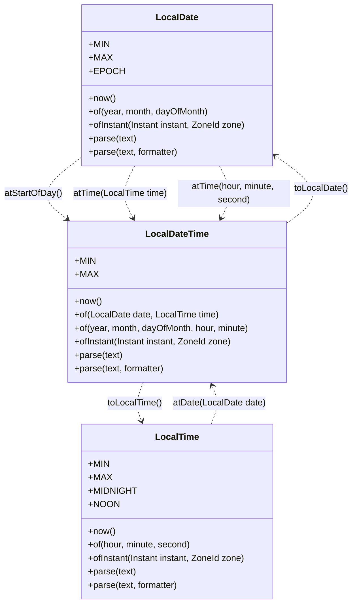
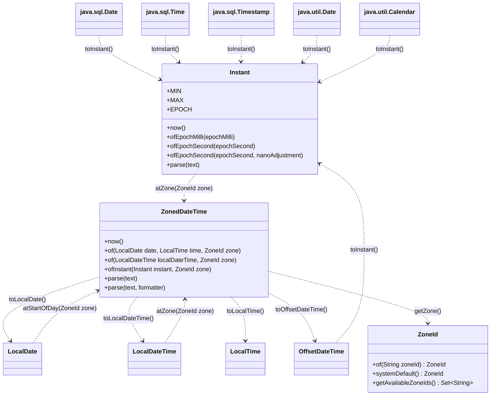
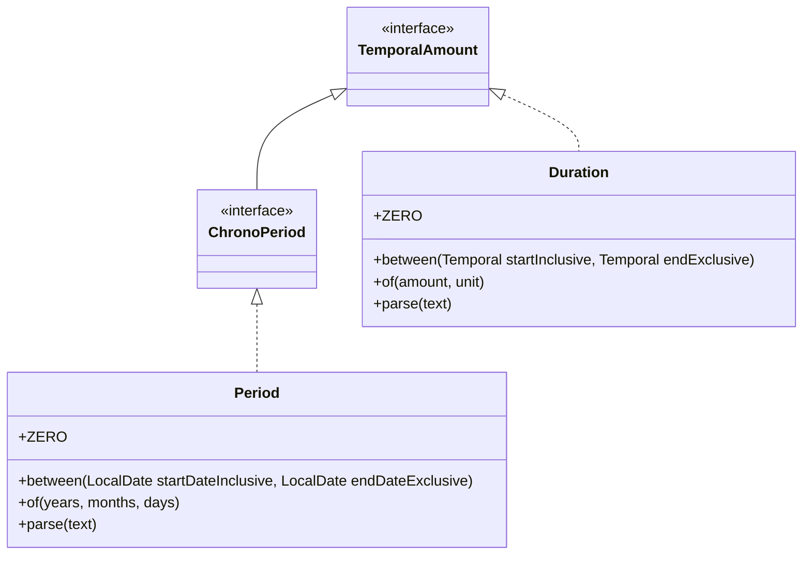
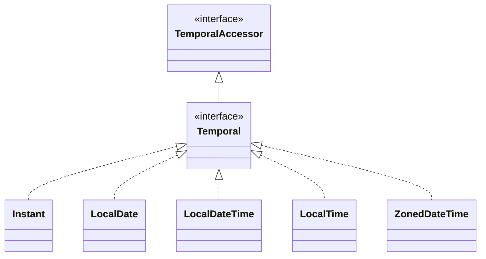

# package [java.time](https://docs.oracle.com/en/java/javase/11/docs/api/java.base/java/time/package-summary.html)

This extract highlights only a little of the functionality of the `java.time` package, just a few classes. My intention was to make an easy architectural cheat sheet for learning purposes. This can be useful for the first steps, but not enough to understand it deeply.

The main goal to present handy constants (_public static final_ fields) and some useful _static_ creation method. Those are like entry points, so every constant points to an instance of the given class, as well as every creation method returns with one of it. Because of this abstraction I did not mark the fields and methods of classes as _static_, even though each of them are. Similarly I did not indicate the type of the constant or the returning value.

There are _instance_ methods as well, but only on the dotted lines, between the classes. But be aware, this line in general UML class diagram represents _dependency_, here its primary function to show transformation opportunities.

The parameter lists are also simplified: In most of the time there are only parameter names to describe the functionality, and I only indicate the type of the given parameter if it plays a significant role in this summary.

I hope it will be useful, but never forget: It is only an extract.

Read the [Java API Specification](https://docs.oracle.com/en/java/javase/11/docs/api/index.html), especially [java.time](https://docs.oracle.com/en/java/javase/11/docs/api/java.base/java/time/package-summary.html) section (also, every class on diagram has link to the related part of it) and there are a lot of useful articles on the internet as well. In addition there is [the source code of java.time package](https://github.com/AdoptOpenJDK/openjdk-jdk11/tree/master/src/java.base/share/classes/java/time).

(Sidenote: All of the presented classes from _java.time_ package are [value-based](https://docs.oracle.com/en/java/javase/11/docs/api/java.base/java/lang/doc-files/ValueBased.html).)

## LocalDate – LocalDateTime – LocalTime

## Instant – ZonedDateTime – ZoneId

## TemporalAmount – ChronoPeriod – Duration – Period

## TemporalAccessor – Temporal

